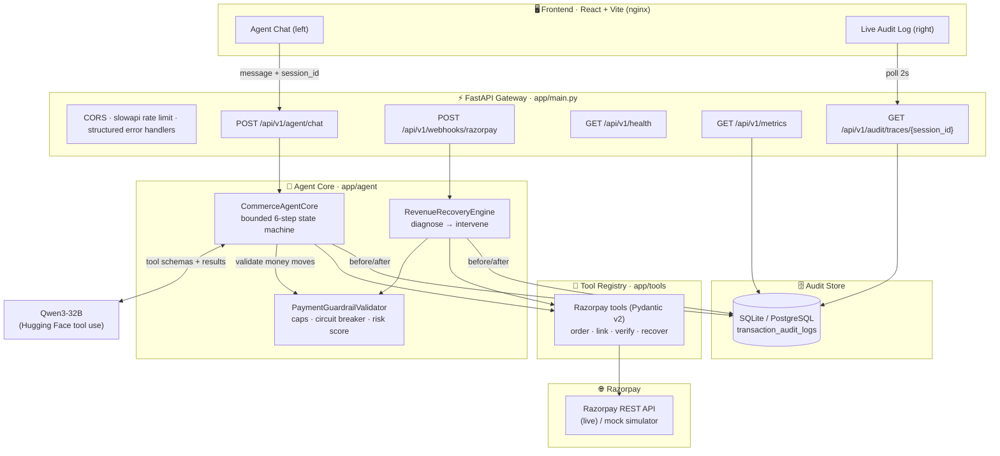

# AgentSeva — Razorpay Agentic Commerce & Recovery Engine

> A **session-aware payments agent** for Indian Kirana stores. Qwen3-32B drives Razorpay
> commerce actions through **strictly-typed tool calls**, every rupee passes a
> **hard financial guardrail**, every step is written to an **append-only audit trail**,
> and failed payments are automatically salvaged by a **revenue-recovery engine**.

Built for the **Razorpay Agentic Commerce Buildathon**: safe, auditable, autonomous money movement.

---

## ✨ Highlights

- 🤖 **Bounded agent state machine** — open-source Qwen3-32B tool use via Hugging Face, capped at **6 steps/turn**, deterministic (`temperature=0`).
- 🛡️ **PaymentGuardrailValidator** — hard caps (₹50,000/order, ₹1,00,000/session), a **circuit breaker** (opens after 3 sequential failures), and **risk-based human-in-the-loop** escalation.
- 🧾 **Append-only audit trail** — every state change and money-moving call writes an immutable `initiated → success/failed` record pair to `transaction_audit_logs`.
- 💸 **Revenue Recovery Engine** — detects `payment.failed` webhooks and dropped checkouts, diagnoses the root cause, and issues a **UPI retry / fresh / discount** payment link.
- 🔒 **Secure gateway** — CORS, rate limiting (slowapi), HMAC-SHA256 webhook verification, structured exception handlers.
- 🖥️ **Live dual-view console** — chat with the agent on the left, watch the audit decision-tree stream in on the right.
- ✅ **96+ unit tests**, and a **mock mode** that runs the entire system offline with no API keys.

---

## 🏗️ System Architecture



**Request lifecycle (chat):** user message → gateway → `CommerceAgentCore` asks Qwen3
→ the model proposes a tool call → **guardrail validates the amount** → tool executes against
Razorpay (or mock) → result audited (before/after) and fed back to the model → repeat until
done or the 6-step ceiling → `AgentResponse(reply, actions_taken, is_complete, requires_escalation)`.

---

## 🏆 How it solves the Razorpay Buildathon requirements

| Buildathon theme | How AgentSeva delivers it |
|---|---|
| **Agentic commerce** | An LLM agent autonomously creates orders, issues payment links, verifies and refunds payments — all via Razorpay tool calls, not hard-coded flows. |
| **Financial safety** | `PaymentGuardrailValidator` gates *every* monetary action: per-order & per-session caps, positive-integer paise checks, currency allowlist, and a circuit breaker that halts repeated failures. |
| **Trust & auditability** | An **append-only** `transaction_audit_logs` table records intent, reasoning, payload, API response, status and latency — before and after each external call. `GET /audit/traces/{session_id}` replays the full decision tree for evaluators. |
| **Revenue recovery** | Automatically turns `payment.failed` webhooks and abandoned checkouts into recovered revenue via diagnosed, compliant interventions (UPI retry / fresh link / capped discount). |
| **No hallucinations** | Rigid Pydantic v2 tool schemas + `temperature=0` + deterministic stopping conditions; invalid tool arguments are rejected before any money moves. |
| **Human-in-the-loop** | Transactions whose risk score exceeds threshold return `requires_escalation=true` and are held for confirmation instead of executing. |
| **Production readiness** | Dockerized gateway with CORS, rate limiting, HMAC-verified webhooks, health & metrics endpoints, and a one-command `docker-compose` boot. |

---

## 🚀 Quickstart (3 steps)

> Prerequisites: **Docker** + **Docker Compose**. No API keys needed — it runs in **mock mode** out of the box.

```bash
# 1) Clone
git clone <your-repo-url> agentseva && cd agentseva

# 2) (optional) create .env with HUGGINGFACE_API_KEY / RAZORPAY_* to go live
# Skip this step to stay in mock mode. Compose provides its own PostgreSQL URL.

# 3) Boot the whole stack
docker-compose up --build
```

Compose starts PostgreSQL with a persistent volume, waits for it to become
healthy, applies the versioned Alembic migrations once, and only then starts the
API. Override the internal database only with `COMPOSE_DATABASE_URL`; the
Replit-managed `DATABASE_URL` is not reused inside Docker networking.

Then open:

| URL | What |
|---|---|
| **http://localhost:5173** | Dual-view console — chat left, live audit logs right |
| **http://localhost:8000/docs** | Interactive API docs (Swagger) |
| **http://localhost:8000/api/v1/health** | Health + dependency status |
| **http://localhost:8000/api/v1/metrics** | Transactions processed · money recovered · failure rate |

**Try it without any keys:** in the console, click **“Simulate failed payment”** or
**“Simulate dropped checkout”** — the Revenue Recovery Engine issues a mock Razorpay
payment link and the audit trail streams in on the right. Add a `HUGGINGFACE_API_KEY`
to enable the live chat agent.

---

## 🔌 API surface

| Method & path | Purpose |
|---|---|
| `POST /api/v1/agent/chat` | Session-aware agent interaction → `AgentResponse` |
| `POST /api/v1/webhooks/razorpay` | HMAC-verified webhook receiver (drives recovery) |
| `GET  /api/v1/health` | Liveness + dependency status |
| `GET  /api/v1/metrics` | Transactions processed, money recovered, failure rate |
| `GET  /api/v1/audit/traces/{session_id}` | Full step-by-step decision tree |
| `POST /api/v1/recovery/checkout` | Recover a dropped checkout |
| `POST /api/v1/engine/agent/run` | Lower-level paise-based engine agent |

---

## 🧱 Project structure

```
.
├── Dockerfile                     # backend image (build context = repo root)
├── docker-compose.yml             # backend + frontend
├── .env.example
├── backend/
│   ├── requirements.txt
│   └── app/
│       ├── main.py                # ⚡ production gateway (this file)
│       ├── core/                  # config, rate limiting
│       ├── agent/                 # core.py (state machine), guardrails.py, recovery.py
│       ├── tools/razorpay_tools.py# bounded Pydantic v2 tool registry
│       ├── engine/                # paise engine (schemas, guardrails, client, tools, agent)
│       ├── audit/logger.py        # append-only transaction_audit_logs
│       ├── db/base.py             # SQLAlchemy engine/session
│       └── api/v1/                # routers (ai, engine, audit, recovery)
└── frontend/
    ├── Dockerfile · nginx.conf
    └── src/pages/AgentConsole.tsx # live dual-view
```

---

## ⚙️ Configuration

All settings come from environment variables / `.env` (see `.env.example`). Key ones:

| Variable | Default | Meaning |
|---|---|---|
| `RAZORPAY_MODE` | `mock` | `mock` (offline simulator) or `live` |
| `DATABASE_URL` | managed by Replit | SQLAlchemy URL for the managed PostgreSQL database |
| `RAZORPAY_KEY_ID` / `RAZORPAY_KEY_SECRET` | — | Razorpay credentials for live mode |
| `RAZORPAY_WEBHOOK_SECRET` | — | Enables HMAC-SHA256 webhook verification |
| `HUGGINGFACE_API_KEY` | — | Enables the live open-source chat agent |
| `HF_LLM_MODEL` | `Qwen/Qwen3-32B` | Agent model |
| `MAX_TXN_AMOUNT_PAISE` | `5000000` | Per-order cap (₹50,000) |
| `DAILY_CAP_PAISE` | `20000000` | Daily/session ceiling |

### Managed PostgreSQL setup

AgentSeva uses the Replit-managed PostgreSQL database in both the workspace and
published app. The runtime never creates or alters tables, so an app restart or
redeploy cannot replace durable orders or either append-only audit table.

For development, apply the versioned Alembic migrations and idempotent catalog seed:

```bash
python scripts/sync-development-db.py
```

This command is also run automatically after task merges. It is safe to repeat:
existing orders and audit rows are not modified, and catalog products are only
inserted when the catalog is empty.

For production, use Replit's **Publish** flow. Publish compares the development
and production schemas, shows any destructive changes or renames for
confirmation, and applies the approved schema diff to the managed production
database. Do not run the development setup command against production. On
application startup, the catalog seed runs as idempotent DML after the published
schema exists, making the seed catalog available without overwriting orders or
audit history.

Both audit tables are protected in PostgreSQL by the versioned
`20260905_02` migration.  `UPDATE`, `DELETE`, and `TRUNCATE` are rejected by
database triggers, and those privileges are revoked from `PUBLIC`; `INSERT`
and `SELECT` remain available to the application.  The triggers are enabled
`ALWAYS`, so they also apply to replication-role sessions.  Apply the
development migration before publishing so the protection is included in the
published schema:

```bash
python scripts/sync-development-db.py
```

To verify the protection without touching the managed database, point the
opt-in PostgreSQL integration test at a disposable database:

```bash
AUDIT_IMMUTABILITY_TEST_DATABASE_URL=postgresql+psycopg://... \
  pytest backend/tests/test_audit_immutability.py
```

The test inserts and reads one row in each audit table, then verifies that
updates and deletes are rejected.  The test also verifies that a normal
Alembic downgrade cannot remove the guard.

### Audit recovery and rollback

Audit records are never repaired by editing or deleting the original row.  If
an event is incorrect, append a new compensating event through the normal audit
logger and retain the original history.  If the database must be recovered,
restore a managed-database backup into an isolated PostgreSQL database, run
`python scripts/sync-development-db.py` against that isolated target, run the
opt-in immutability test, inspect both audit tables, and only then cut over or
publish the verified state.

Application releases can be rolled back without rolling back the schema.  The
audit-protection migration is intentionally forward-only: `alembic downgrade`
refuses to remove the triggers, and the initial schema migration already
refuses destructive downgrades.  This keeps audit history protected during
release rollback.  If a migration does not complete, leave the database at its
last successful revision and rerun `alembic upgrade head` after correcting the
deployment; do not disable the triggers or run ad-hoc UPDATE/DELETE queries.

For the first cutover from the legacy VM-local SQLite database:

1. Stop writes to the old deployment and copy its `app.db` as a read-only
   snapshot.
2. Set up the managed development schema, then import the snapshot:

   ```bash
   python scripts/sync-development-db.py
   cd backend
   python -m app.db.import_sqlite /path/to/app.db --confirm-development-import
   ```

   The import is one transaction. It preserves order IDs, regenerates
   unreferenced audit row IDs, aborts on an order-ID collision, and prints
   committed import counts only after the target transaction succeeds.
3. Inspect the imported development orders and both audit tables.
4. Publish and select **overwrite data** for this one-time cutover. Replit first
   applies the development schema to the fresh production database, then copies
   the verified development data. Later publishes should use normal schema
   diffs, not overwrite data.

Because all persistent records are in managed PostgreSQL rather than a VM-local
SQLite file, restarts and redeployments retain data and the deployment may use
Autoscale.

Before publishing database changes, run the PostgreSQL persistence smoke check
against the managed development database:

```bash
AGENTSEVA_POSTGRES_SMOKE=1 python scripts/check-postgres-persistence.py
```

The check requires explicit opt-in, refuses to run from a deployment, and
applies the real migrations in a uniquely named temporary schema. It verifies
every registered table, idempotent catalog seeding, no DDL during application
startup, and persistence of an order plus both audit record types through a
fresh app process. The temporary schema is dropped afterward, including when
the check fails, so merchant tables and rows are not modified.

---

## 🧪 Testing

```bash
cd backend
pip install -r requirements.txt
pytest            # 96+ tests, fully offline (mock mode)
```

Covers guardrails, circuit breaker, audit before/after semantics, recovery diagnosis
& interventions, the bounded state machine, the Razorpay tool registry, and the gateway
endpoints (via `TestClient`).

---

## 🔐 Security notes

- Webhooks are verified with **HMAC-SHA256** (`X-Razorpay-Signature`) via constant-time comparison when `RAZORPAY_WEBHOOK_SECRET` is set; invalid signatures get `401`.
- The audit trail is **append-only by construction** — no update/delete path is exposed, and PostgreSQL rejects UPDATE, DELETE, and TRUNCATE at the database layer.
- Rate limiting (slowapi) protects the chat and webhook endpoints; secrets are never committed (`.env` is git-ignored; `.env.example` documents them).
